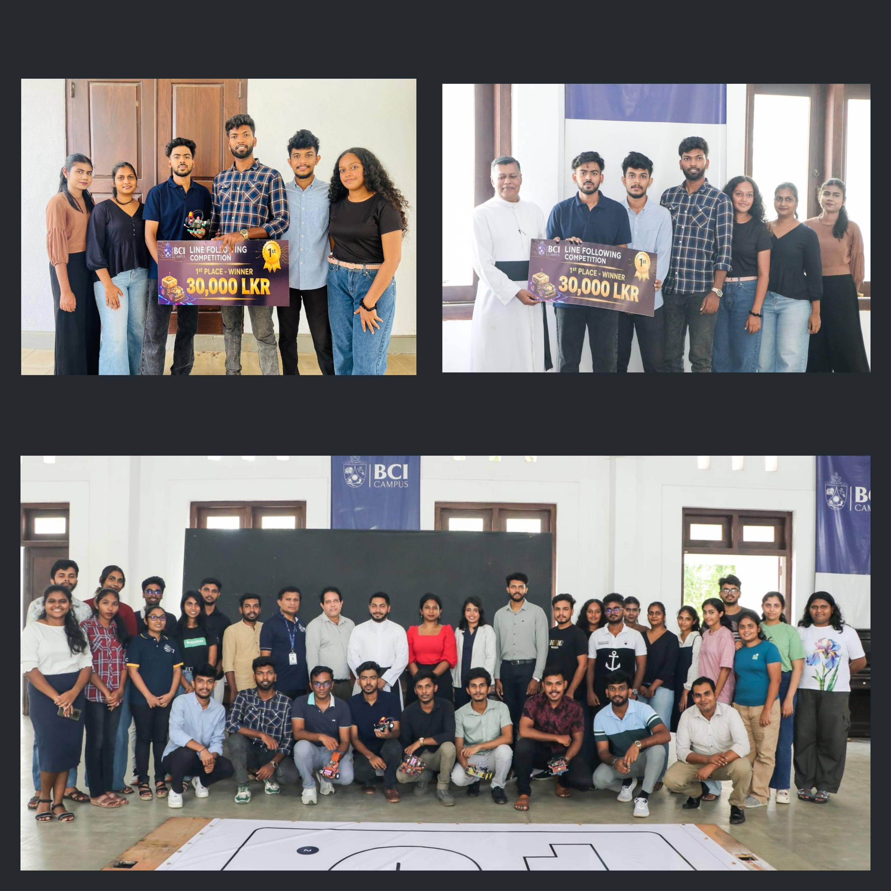

# GIDEON 1.0 | Line Following Robot

**Team Aura** | BCI Campus, Negombo

---

## Overview

GIDEON 1.0 is a line following robot built for the BCI Campus Negombo Line Following Robot Competition 2026. The robot placed **1st Place**, making us the winning team of the competition. Core development is complete, though the project remains open for occasional improvements and experiments. The code is open for the community to learn from, build on, and experiment with. - WHILE(ALIVE) LEARN();

---

<b>Team</b>

 

**Brian Fernandez** @brianmfdz| Team Leader & Lead Software Developer -
Responsible for core logic, PID integration, system architecture, and overall development.

**Sanjana & Kawye** @Prabashika-s @kawyekavishan12 | Handles the Connectivity & Communication between robot and control app, ensuring stable and reliable data transfer.

**Diluksha** @dilukshefdo | PID Performance Logging and system performance analysis.

**Dilmi & Uvindu** @Dilmi100 @Uvindu-Sathsara | Responsible for hardware selection and balanced integration.

**Navodya** @navodya-sankalpani | Technical Research & Innovation - Researches technologies and suggests improvements for system optimization.

**Savinda** @savindamahasingha | Financial & Resource Management - Manages budget, resources, and component procurement.

---

<b>Project Status</b>

 

Development complete. The robot successfully competed and placed 1st at the BCI Campus Negombo Line Following Robot Competition 2026. The codebase is stable and no further core changes are planned. Occasional upgrades or experiments may be added over time..

---

<b>Goals</b>

 

- Accurate and fast line tracking
- PID tuning for smooth performance
- Stable wireless communication
- Full system integration

---

<b>Competition</b>

 

- **Event:** Line Following Robot Competition
- **Venue:** BCI Campus, Negombo
- **Robot:** GIDEON 1.0

---

<b>Hardware Overview</b>

 

Power flows from the **7.4V 2S 95C LiPo battery** through buck converter — the **MP1584** delivers a clean voltage rail for the ESP32, motors and mini 360 buck converter. The **Mini 360** handles the power to the sensors and motor driver logic separately. Two **SPDT switches** control power to the system (one for the board one for the motors).

The **ESP32 DevKit V1** sits at the center of everything. It collects the readings from all the 8  **CNY70 reflective optical sensors**, runs the control algorithm, and fires PWM and direction signals to the **TB6612FNG motor driver**.

The driver then controlls the **N20 6V 540RPM geared motors** according to the signals from esp32, steering the robot purely through the speed difference between the wheels. Each motor is mounted via an **N20 bracket** driving a **43mm rubber wheel**, with a front **15mm caster wheel** keeping the sensor array at a consistent height above the track.

 

| Component | Details | Qty |
|---|---|---|
| Microcontroller | ESP32 Dev module v1 30-pin | 1 |
| Motor Driver | TB6612FNG Dual DC Stepper Motor Driver Module | 1 |
| Motors | N20 540RPM 6VDC Metal Gear Motor 3mm Shaft | 2 |
| Line Sensors | CNY70 Reflective Optical Sensor | 8 |
| Wheels | D-hole Rubber Wheel 43x19x3mm | 2 |
| Castor Wheel | N20 Standard 15mm High Universal Wheel | 1 |
| Motor Mounts | N20 Gear Motor Mount Bracket | 2 |
| Buck Converter | Mini 360 DC 2A Step Down | 1 |
| Buck Module | MP1584 4.5-28V to 0.8V-18V 3A Step Down | 1 |
| Battery | 7.4V 1500mAh 2S 95C LiPo battery | 1 |
| Display | 0.96 inch 128x64 OLED Blue I2C | 1 |
| Switch | SPDT Toggle Switch 3-Pin (ON-OFF-ON) | 2 |

---

<b>GPIO Pin Configuration</b>

 

---

<b>Algorithm Research & Selection</b>

 

| Component | Researched | Selected | Why |
|-----------|-----------|----------|-----|
| Position Detection | Binary threshold, Weighted average, Center of mass, Edge detection | Weighted Average with Intensity Scaling | Best balance of accuracy and smoothness for 1.5cm lines |
| PID Control | P-only, PI, PID, Fuzzy logic | PID Control | Industry standard, handles sharp turns and curves reliably |
| Turn Detection | Static threshold, Edge spike detection, Lookahead with creep, Machine learning | Edge Spike + look ahead Detection with 2-Frame Confirmation | 95% accuracy without being too heavy for ESP32 |
| Line Loss Recovery | Stop and wait, Forward creep, Spin in place, Spiral search | Spin in Place with Direction Memory | 95% success rate, fastest recovery using last known side |
| Speed Adaptation | Fixed speed, Simple slowdown, Deviation-based, Predictive lookahead | Deviation-Based Adaptive Speed | Robot naturally slows on curves proportional to error |
| Filtering | None, 3-sample average, 5-sample average, Exponential | 3-Sample Moving Average | Best noise reduction without slowing response on sharp turns |

**Conclusion:** This combination provides reliable performance on 1.5cm line tracks with sharp 90° turns, fake branches, and intersections - all within ESP32 computational limits.

---

<b>PID Tuning Log</b>

 

---

<b>Financial & Resource Management</b>

 

The project was initially planned with a base budget of **LKR 16,000**, with an overall allowable budget of approximately **LKR 20,000** including a reserved emergency allocation for unexpected expenses, hardware replacements, and testing related risks.

To maximize competitive performance, the team strategically invested more resources into critical performance related areas rather than distributing the budget evenly across all components. A **LiPo battery system** was selected for its superior discharge capability and responsiveness during high speed operation, while additional investment was made in a higher quality chassis to improve stability, balance, and tracking accuracy during fast line following.

Due to stock limitations and component availability issues, several parts had to be sourced from alternative suppliers at higher market prices than originally estimated. During testing, the ESP32 board failed due to an issue with the integrated CP2102 serial communication interface, requiring the entire board to be replaced using the reserved emergency allocation.

The **final total expenditure was LKR 18,951**, and all project costs were shared equally among team members.

---