# GIDEON 1.0 | Line Following Robot

**Team Aura** | BCI Campus, Negombo

---

## Overview

GIDEON 1.0 is a line following robot built for the BCI Campus Negombo Line Following Robot Competition. This project is currently under active development.

---

## Team

**Brian Fernandez** | Team Leader & Lead Software Developer -
Responsible for core logic, PID integration, system architecture, and overall development.

**Sanjana & Kawye** | Handles the Connectivity & Communication between robot and control app, ensuring stable and reliable data transfer.

**Diluksha** | PID Performance Logging and system performance analysis.

**Dilmi & Uvindu** | Responsible for hardware selection and balanced integration.

**Navodya** | Technical Research & Innovation - Researches technologies and suggests improvements for system optimization.

**Savinda** | Financial & Resource Management - Manages budget, resources, and component procurement.

---

## Project Status

Currently under active development and testing.

---

## Goals

- Accurate and fast line tracking
- PID tuning for smooth performance
- Stable wireless communication
- Full system integration

---

## Competition

- **Event:** Line Following Robot Competition
- **Venue:** BCI Campus, Negombo
- **Robot:** GIDEON 1.0

---

## Hardware

| Component | Details | Qty |
|---|---|---|
| Microcontroller | NodeMCU ESP32 Dev Board Type-C 30-pin | 1 |
| Motor Driver | TB6612FNG Dual DC Stepper Motor Driver Module | 1 |
| Motors | N20 540RPM 6VDC Metal Gear Motor 3mm Shaft | 2 |
| Line Sensors | CNY70 Reflective Optical Sensor | 8 |
| Wheels | D-hole Rubber Wheel 43x19x3mm | 2 |
| Castor Wheel | N20 Standard 15mm High Universal Wheel | 1 |
| Motor Mounts | N20 Gear Motor Mount Bracket | 2 |
| Buck Converter | Mini 360 DC 2A Step Down | 1 |
| Buck Module | MP1584 4.5-28V to 0.8V-18V 3A Step Down | 2 |
| Battery | 7.4V 1500mAh 2S 95C LiPo XT60 Plug | 1 |
| Display | 0.96 inch 128x64 OLED Blue I2C | 1 |
| Switch | SPDT Toggle Switch 3-Pin (ON-OFF-ON) | 2 |

---

## GPIO Pin Configuration

---
## ⚙️ Hardware Overview

Power flows from the **7.4V 2S 95C LiPo battery** through two buck converters — the **MP1584** delivers a clean voltage rail for the ESP32 and sensors, and the **Mini 360** handles the motor driver logic separately. Two **SPDT switches** control power to the system.

The **ESP32 DevKit V1** sits at the center of everything. It polls all eight **CNY70 reflective optical sensors**, runs the control algorithm, and fires PWM and direction signals to the **TB6612FNG motor driver**.

The driver translates those low-current signals into the full current needed to spin two **N20 6V 540RPM geared motors** independently, steering the robot purely through the speed difference between the wheels. Each motor is mounted via an **N20 bracket** driving a **43mm rubber wheel**, with a front **15mm caster wheel** keeping the sensor array at a consistent height above the track.

A **0.96" 128x64 OLED display** shows live system state and sensor feedback during tuning.

---
This README will be actively updated as the project progresses.
